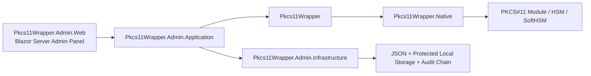

# Pkcs11Wrapper

[](https://github.com/EbubekirERGUN/Pkcs11Wrapper/actions/workflows/ci.yml)
[](https://github.com/EbubekirERGUN/Pkcs11Wrapper/actions/workflows/benchmarks.yml)
[](https://dotnet.microsoft.com/)
[](#platform--validation-status)
[](#platform--validation-status)
[](#blazor-server-admin-panel)
[](#feature-highlights)

Modern **.NET 10 PKCS#11 wrapper** with strong Linux validation, Windows support, PKCS#11 v3 interface/message awareness, and a growing **Blazor Server admin panel** for HSM operations.

> Turkish README: [README.tr.md](README.tr.md)

## Why this project exists

PKCS#11 integrations are powerful, but they are often awkward to consume from modern .NET codebases. `Pkcs11Wrapper` aims to provide a cleaner, explicit, testable, and production-minded foundation for:

- HSM and smart-card integrations
- signing / verification / key lifecycle operations
- Windows + Linux deployments
- vendor PKCS#11 compatibility work
- operational visibility through an admin panel

## Feature highlights

### Core wrapper

- Explicit managed API over a native PKCS#11 / Cryptoki module
- .NET 10 focused
- Linux + Windows support
- NativeAOT-aware design
- PKCS#11 v3 interface discovery support
- PKCS#11 v3 message API support when exposed by the module
- Configurable initialize flow (`CK_C_INITIALIZE_ARGS`, mutex callbacks, OS locking)

### Validation and engineering discipline

- Fixture-backed SoftHSM regression suite
- Windows runtime + `win-x64` NativeAOT smoke validation with SoftHSM-for-Windows
- NativeAOT smoke validation on Linux
- BenchmarkDotNet performance baseline + periodic benchmark workflow with allocation/regression reporting
- Optional vendor regression lane
- Release verification script, package-safe NuGet README, and SourceLink/symbol package validation

### Admin panel

- Blazor Server admin UI
- local auth with `viewer` / `operator` / `admin` roles
- HSM device profile management + configuration export/import
- vendor-aware device profiles with optional catalog metadata + setup hints
- slot/token inspection
- key/object browsing, detail, edit, copy, generate, import, and destroy flows
- tracked session visibility and control (`login` / `logout` / `cancel` / `close-all` + invalidation visibility)
- PKCS#11 Lab diagnostics, crypto experiments, object workflows, and scenario replay helpers
- PKCS#11 telemetry viewer with redacted device / slot / mechanism / status filtering, bounded retention/rotation, safe export, and audit correlation links
- protected PIN cache + append-only chained audit log integrity

## Platform & validation status

| Area | Status | Notes |
| --- | --- | --- |
| Linux | ✅ | deepest runtime validation path, fixture-backed regression + NativeAOT smoke |
| Windows | ✅ | fixture-backed runtime regression + `win-x64` NativeAOT smoke through SoftHSM-for-Windows + OpenSC |
| PKCS#11 v3 interface discovery | ✅ | capability-gated when not exported by the module |
| PKCS#11 v3 message APIs | ✅ | managed/API support implemented; runtime depends on module support |
| Admin panel | ✅ | functional Blazor Server management surface with auth, local users, config transfer, audit integrity, and PKCS#11 Lab |
| Vendor regression lane | ✅ | optional non-SoftHSM validation path |

## Repository architecture



## Quick start

### 1) Use the library

```bash
dotnet add package Pkcs11Wrapper
```

```csharp
using Pkcs11Wrapper;

using Pkcs11Module module = Pkcs11Module.Load("/path/to/pkcs11/module");
module.Initialize(new Pkcs11InitializeOptions(Pkcs11InitializeFlags.UseOperatingSystemLocking));

int slotCount = module.GetSlotCount();
Console.WriteLine($"Discovered {slotCount} slot(s).");
```

### Structured operation telemetry

Telemetry is opt-in and disabled by default. When you attach a listener, the wrapper emits a compact structured event after each major PKCS#11 wrapper operation with:

- operation name + native PKCS#11 function name
- elapsed duration
- success / returned-false / failure status
- native return value when available
- optional slot, session, and mechanism context
- redacted `Fields` for safe metadata, masked credentials, hashed identifiers, and length-only payload summaries
- captured exception for faulted operations

Listener failures are swallowed so observational code does not break the underlying PKCS#11 call flow. The wrapper never emits raw PINs, key material, plaintext/ciphertext payloads, unwrap/import blobs, or secret PKCS#11 attributes. See `docs/telemetry-redaction.md` for the full policy.

This telemetry is intentionally **wrapper-side observability**, not a replacement for **vendor-native HSM audit logs**. It tells you what this process did through `Pkcs11Wrapper`; it does not automatically prove everything the HSM saw across other clients, appliance roles, or vendor-specific control planes. See `docs/vendor-audit-integration.md` for the conservative boundary and the Thales Luna audit-integration evaluation.

```csharp
using Pkcs11Wrapper;
using Pkcs11Wrapper.Native;

sealed class ConsoleTelemetryListener : IPkcs11OperationTelemetryListener
{
    public void OnOperationCompleted(in Pkcs11OperationTelemetryEvent operationEvent)
    {
        Console.WriteLine(
            $"{operationEvent.OperationName} ({operationEvent.NativeOperationName}) " +
            $"status={operationEvent.Status} duration={operationEvent.Duration.TotalMilliseconds:F3}ms " +
            $"slot={operationEvent.SlotId} session={operationEvent.SessionHandle} mechanism={operationEvent.MechanismType}");
    }
}

using Pkcs11Module module = Pkcs11Module.Load("/path/to/pkcs11/module", new ConsoleTelemetryListener());
module.Initialize(new Pkcs11InitializeOptions(Pkcs11InitializeFlags.UseOperatingSystemLocking));
```

You can also swap the listener at runtime through `Pkcs11Module.TelemetryListener`.

Built-in opt-in adapters let you project the same redacted event stream into `ILogger` and `ActivitySource` / OpenTelemetry-style tracing without coupling the PKCS#11 call path to a specific logging stack:

```csharp
using System.Diagnostics;
using Microsoft.Extensions.Logging;
using Pkcs11Wrapper;

using ILoggerFactory loggerFactory = LoggerFactory.Create(builder => builder.AddConsole());
ILogger logger = loggerFactory.CreateLogger("Pkcs11");
using ActivitySource activitySource = new("MyCompany.Security.Pkcs11");

IPkcs11OperationTelemetryListener? telemetry = Pkcs11TelemetryListeners.Create(
    logger: logger,
    activitySource: activitySource);

using Pkcs11Module module = Pkcs11Module.Load("/path/to/pkcs11/module", telemetry);
module.Initialize();
```

- `Pkcs11LoggerTelemetryListener` maps success / returned-false / failure outcomes to `Information` / `Warning` / `Error` by default and emits structured scope properties for slot, session, mechanism, return value, and redacted fields.
- `Pkcs11ActivityTelemetryListener` creates short-lived internal activities (`pkcs11.{OperationName}` by default), attaches the same redacted metadata as tags, and records failures as errored activities with an exception event when applicable.
- `Pkcs11CompositeTelemetryListener` and `Pkcs11TelemetryListeners.Combine/Create(...)` let you fan out to multiple sinks while keeping the core wrapper telemetry listener model unchanged.

See [docs/telemetry-integrations.md](docs/telemetry-integrations.md) for detailed examples and the emitted scope/tag shape.

### 2) Run the admin panel

```bash
cd src/Pkcs11Wrapper.Admin.Web
dotnet run
```

For local source-tree development, first run seeds a bootstrap admin credential file under `App_Data/bootstrap-admin.txt`.

For CI/automation/container scenarios you can externalize the runtime storage root, bootstrap credential, first PKCS#11 module path, and runtime behavior:

```bash
export AdminStorage__DataRoot=/tmp/pkcs11wrapper-admin-data
export LocalAdminBootstrap__UserName=ci-admin
export LocalAdminBootstrap__Password='AdminE2E!Pass123'
export AdminBootstrapDevice__Name='SoftHSM demo'
export AdminBootstrapDevice__ModulePath=/usr/lib/softhsm/libsofthsm2.so
export AdminRuntime__DisableHttpsRedirection=true
```

### 2b) Build and run the container image

```bash
docker build -f src/Pkcs11Wrapper.Admin.Web/Dockerfile -t pkcs11wrapper-admin .
```

The image defaults to:

- `AdminStorage__DataRoot=/var/lib/pkcs11wrapper-admin`
- `AdminRuntime__DisableHttpsRedirection=true`
- `ASPNETCORE_URLS=http://+:8080`

For the standalone container deployment path, start from:

- [docs/admin-container.md](docs/admin-container.md)
- `deploy/container/admin-panel.env.example`

That guide covers the runtime contract, first-run bootstrap behavior, storage-root contents, PKCS#11 module mount patterns, non-root bind-mount permissions, upgrade/backup expectations, and the distinction between the standalone container image and the local SoftHSM compose lab.

### 2c) Run the local SoftHSM compose lab stack

```bash
cd deploy/compose/softhsm-lab
cp .env.example .env
# optional: edit .env

docker compose up --build -d
```

This stack is deliberately aimed at **local/dev/lab** usage, not production orchestration. It brings up the admin panel plus a SoftHSM-backed token environment with shared volumes for repeatable local reuse. See [deploy/compose/softhsm-lab/README.md](deploy/compose/softhsm-lab/README.md) for setup, seeded credentials/PINs, and reset/reseed commands.

### 3) Run validation

Linux:

```bash
./eng/run-regression-tests.sh
./eng/run-admin-e2e.sh
./eng/run-smoke-aot.sh
./eng/run-benchmarks.sh
```

Windows PowerShell:

```powershell
.\eng\setup-softhsm-fixture.ps1 -DownloadPortable -EnvFilePath "$env:TEMP\pkcs11-fixture.ps1"
.\eng\run-regression-tests.ps1 -UseExistingEnv -EnvFilePath "$env:TEMP\pkcs11-fixture.ps1"
.\eng\run-smoke.ps1 -UseExistingEnv -EnvFilePath "$env:TEMP\pkcs11-fixture.ps1" -Strict
.\eng\run-smoke-aot.ps1 -UseExistingEnv -EnvFilePath "$env:TEMP\pkcs11-fixture.ps1" -Strict
.\eng\run-benchmarks.ps1 -UseExistingEnv -EnvFilePath "$env:TEMP\pkcs11-fixture.ps1"
```

## Performance benchmarks

The repository now ships with a dedicated `BenchmarkDotNet` suite so performance work is measured instead of guessed.

Current benchmark coverage includes:

- managed template/provisioning helpers
- module lifecycle + mechanism discovery
- session open/login/info paths
- object lookup, large-slot page browse, attribute reads, create/update/destroy
- AES key generation and RSA keypair generation
- random, digest, encrypt, decrypt, sign, verify

Latest committed Linux + SoftHSM baseline (`docs/benchmarks/latest-linux-softhsm.md`):

- Published benchmark date (UTC): **2026-04-02 10:17**
- Benchmark environment: **Arch Linux + SoftHSM + .NET SDK 10.0.201 / Runtime 10.0.5**

| Benchmark | Baseline |
| --- | ---: |
| `LoadInitializeGetInfoFinalizeDispose` | `1.934 μs` |
| `OpenReadOnlySessionAndGetInfo` | `8.036 μs` |
| `GenerateRandom32` | `149.094 ns` |
| `EncryptAesCbcPad_1KiB` | `6.352 μs` |
| `VerifySha256RsaPkcs_1KiB` | `19.607 μs` |
| `BrowseFirstDataObjectPage64Of256` | `49.451 μs` |
| `GenerateDestroyRsaKeyPair` | `25.145 ms` |

Automated GitHub benchmark runs now publish a GitHub-friendly report per run with:

- generated date/time (UTC)
- runner environment (`OS`, architecture, SDK, runtime, PKCS#11 module)
- headline benchmark numbers for the main reference operations
- allocation figures and optional committed-baseline deltas for those headline benchmarks
- downloadable artifacts containing `summary.md`, `summary.json`, and raw BenchmarkDotNet CSV/HTML/markdown outputs

That workflow report shows the **latest executed run** on GitHub, while `docs/benchmarks/latest-linux-softhsm.md` remains the latest **reviewed and committed** baseline snapshot.

Full benchmark guidance and rerun flow:

- [docs/benchmarks.md](docs/benchmarks.md)
- [docs/benchmarks/latest-linux-softhsm.md](docs/benchmarks/latest-linux-softhsm.md)

## Blazor Server admin panel

The admin panel is designed as an operational layer **on top of** the library instead of being embedded inside the core wrapper.

Current capabilities include:

- device profile CRUD with optional vendor metadata/profile selection
- local cookie auth with `viewer` / `operator` / `admin` roles
- local user management, password rotation, and bootstrap credential lifecycle controls
- PKCS#11 module connection testing
- vendor-aware setup hints/caveats on Devices, Slots, Keys, and PKCS#11 Lab when a vendor-tagged profile is selected
- slot and token browsing
- key/object listing, detail, edit, copy, generate, import, destroy workflows
- tracked session login/logout/cancel controls + slot-level close-all
- health/invalidation visibility for sessions
- protected PIN caching for repeat operations
- device-profile configuration export/import
- PKCS#11 Lab for diagnostics, crypto operations, object inspection, wrap/unwrap, raw attribute reads, and scenario replay
- PKCS#11 telemetry viewer for redacted wrapper-level operation traces, bounded retention/export control, and audit correlation
- append-only chained audit entries with integrity verification

## Documentation map

- [docs/development.md](docs/development.md) - repo layout, development workflow, validation structure
- [docs/compatibility-matrix.md](docs/compatibility-matrix.md) - supported capability areas and current limits
- [docs/windows-local-setup.md](docs/windows-local-setup.md) - local Windows fixture/bootstrap path
- [docs/benchmarks.md](docs/benchmarks.md) - benchmark scope, rerun flow, periodic tracking model
- [docs/benchmarks/latest-linux-softhsm.md](docs/benchmarks/latest-linux-softhsm.md) - latest committed Linux benchmark baseline
- [docs/admin-container.md](docs/admin-container.md) - standalone admin-container deployment guide, volume layout, PKCS#11 mount patterns, and local/dev vs production-safe guidance
- `deploy/container/admin-panel.env.example` - starter env template for the standalone admin container path
- [deploy/compose/softhsm-lab/README.md](deploy/compose/softhsm-lab/README.md) - local/dev/lab compose stack for the admin panel + SoftHSM backend
- [docs/admin-ops-recovery.md](docs/admin-ops-recovery.md) - local admin-panel operations and recovery runbook
- [docs/vendor-regression.md](docs/vendor-regression.md) - vendor compatibility profile and env contract
- [docs/luna-integration.md](docs/luna-integration.md) - practical Thales Luna client/module setup guidance for wrapper, admin panel, smoke, and vendor regression
- [docs/luna-compatibility-audit.md](docs/luna-compatibility-audit.md) - public-doc audit of Thales Luna standard compatibility vs current wrapper/admin/runtime scope
- [docs/cloudhsm-integration.md](docs/cloudhsm-integration.md) - practical AWS CloudHSM Client SDK 5 setup guidance for wrapper and admin-panel usage
- [docs/cloudhsm-compatibility-audit.md](docs/cloudhsm-compatibility-audit.md) - public-doc audit of AWS CloudHSM standard PKCS#11 compatibility vs current wrapper/admin/runtime scope
- [docs/google-cloud-hsm-integration.md](docs/google-cloud-hsm-integration.md) - practical Google Cloud KMS / Cloud HSM via kmsp11 setup guidance for wrapper and admin-panel usage
- [docs/google-cloud-hsm-compatibility-audit.md](docs/google-cloud-hsm-compatibility-audit.md) - public-doc audit of Google Cloud HSM's indirect kmsp11 PKCS#11 path vs current wrapper/admin/runtime scope
- [docs/luna-vendor-extension-design.md](docs/luna-vendor-extension-design.md) - proposed package/boundary/loading/test strategy for future Luna-only `CA_*` support
- [docs/vendor-audit-integration.md](docs/vendor-audit-integration.md) - vendor-native audit evaluation starting with Thales Luna, including CLI/syslog/export/API path trade-offs vs wrapper telemetry
- [docs/smoke.md](docs/smoke.md) - smoke sample behavior and troubleshooting
- [docs/telemetry-redaction.md](docs/telemetry-redaction.md) - PKCS#11 telemetry redaction policy
- [docs/telemetry-integrations.md](docs/telemetry-integrations.md) - `ILogger` and `ActivitySource` / OpenTelemetry integration guidance
- [docs/admin-telemetry-operations.md](docs/admin-telemetry-operations.md) - admin telemetry retention, rotation, export, and audit-correlation operations
- [docs/release.md](docs/release.md) - release checklist and packaging discipline
- [docs/versioning.md](docs/versioning.md) - centralized versioning model and tag strategy
- [docs/admin-panel-roadmap.md](docs/admin-panel-roadmap.md) - admin panel roadmap
- [docs/github-showcase.md](docs/github-showcase.md) - suggested GitHub repo description/topics/social preview copy

## Current limitations

- Full PKCS#11 behavior still depends on the target token / HSM / vendor policy.
- Some advanced operations (for example import/edit/copy overrides) may be rejected by token policy even when the wrapper supports the call surface.
- The current admin auth/security model is intentionally local-host oriented; external IdP/IAM, MFA, and centralized secret governance are not part of the app yet.
- Linux is still the primary benchmark/reference environment, even though Windows now also has fixture-backed NativeAOT smoke validation.
- PKCS#11 v3 runtime behavior still depends on whether the target module actually exports the relevant v3 interface surface.
- AWS CloudHSM support in the current repo is a documented/admin-readiness slice, not a claim of live cluster-backed CI validation yet.
- Google Cloud HSM support in the current repo is an indirect kmsp11/Cloud KMS slice with docs and admin guardrails, not a claim of direct-HSM client support or live Google-backed CI validation yet.

## Contributing

If you want to improve the wrapper, validation matrix, Windows/Linux support, or admin panel UX, check:

- [CONTRIBUTING.md](CONTRIBUTING.md)
- [SECURITY.md](SECURITY.md)
- issue templates under `.github/ISSUE_TEMPLATE/`

## Roadmap snapshot

Near-term focus areas:

- next admin panel polish slices (dashboard/widget expansion, table ergonomics, wider filtering/sorting/paging coverage)
- stronger vendor-backed runtime validation for PKCS#11 v3-capable modules
- recurring benchmark reruns with latest published baseline refreshes
- more polished GitHub showcase assets (screenshots / demo media / release notes)

## Project positioning

`Pkcs11Wrapper` is intended for teams building:

- e-signature / certificate workflows
- HSM-backed signing services
- secure key management tooling
- PKCS#11 integration layers in .NET systems
- operational consoles for token / slot / object lifecycle work

If you work in PKCS#11, HSM, smart card, or cryptographic infrastructure space, this project is meant to be a practical foundation rather than just a thin P/Invoke sample.
