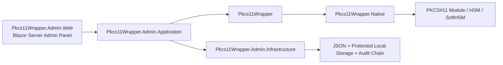

# Pkcs11Wrapper

[](https://github.com/EbubekirERGUN/Pkcs11Wrapper/actions/workflows/ci.yml)
[](https://github.com/EbubekirERGUN/Pkcs11Wrapper/actions/workflows/benchmarks.yml)
[](https://dotnet.microsoft.com/)
[](#platform--validation-status)
[](#platform--validation-status)
[](#blazor-server-admin-panel)
[](#feature-highlights)

Modern **.NET 10 PKCS#11 wrapper** with strong Linux validation, Windows support, PKCS#11 v3 interface/message awareness, and a growing **Blazor Server admin panel** for HSM operations.

> Turkish README: [README.tr.md](README.tr.md)

## Why this project exists

PKCS#11 integrations are powerful, but they are often awkward to consume from modern .NET codebases. `Pkcs11Wrapper` aims to provide a cleaner, explicit, testable, and production-minded foundation for:

- HSM and smart-card integrations
- signing / verification / key lifecycle operations
- Windows + Linux deployments
- vendor PKCS#11 compatibility work
- operational visibility through an admin panel

## Feature highlights

### Core wrapper

- Explicit managed API over a native PKCS#11 / Cryptoki module
- .NET 10 focused
- Linux + Windows support
- NativeAOT-aware design
- PKCS#11 v3 interface discovery support
- PKCS#11 v3 message API support when exposed by the module
- Configurable initialize flow (`CK_C_INITIALIZE_ARGS`, mutex callbacks, OS locking)

### Validation and engineering discipline

- Fixture-backed SoftHSM regression suite
- Windows runtime + `win-x64` NativeAOT smoke validation with SoftHSM-for-Windows
- NativeAOT smoke validation on Linux
- BenchmarkDotNet performance baseline + periodic benchmark workflow with allocation/regression reporting
- Optional vendor regression lane
- Release verification script, package-safe NuGet README, and SourceLink/symbol package validation

### Admin panel

- Blazor Server admin UI
- local auth with `viewer` / `operator` / `admin` roles
- HSM device profile management + configuration export/import
- slot/token inspection
- key/object browsing, detail, edit, copy, generate, import, and destroy flows
- tracked session visibility and control (`login` / `logout` / `cancel` / `close-all` + invalidation visibility)
- PKCS#11 Lab diagnostics, crypto experiments, object workflows, and scenario replay helpers
- protected PIN cache + append-only chained audit log integrity

## Platform & validation status

| Area | Status | Notes |
| --- | --- | --- |
| Linux | ✅ | deepest runtime validation path, fixture-backed regression + NativeAOT smoke |
| Windows | ✅ | fixture-backed runtime regression + `win-x64` NativeAOT smoke through SoftHSM-for-Windows + OpenSC |
| PKCS#11 v3 interface discovery | ✅ | capability-gated when not exported by the module |
| PKCS#11 v3 message APIs | ✅ | managed/API support implemented; runtime depends on module support |
| Admin panel | ✅ | functional Blazor Server management surface with auth, local users, config transfer, audit integrity, and PKCS#11 Lab |
| Vendor regression lane | ✅ | optional non-SoftHSM validation path |

## Repository architecture



## Quick start

### 1) Use the library

```bash
dotnet add package Pkcs11Wrapper
```

```csharp
using Pkcs11Wrapper;

using Pkcs11Module module = Pkcs11Module.Load("/path/to/pkcs11/module");
module.Initialize(new Pkcs11InitializeOptions(Pkcs11InitializeFlags.UseOperatingSystemLocking));

int slotCount = module.GetSlotCount();
Console.WriteLine($"Discovered {slotCount} slot(s).");
```

### 2) Run the admin panel

```bash
cd src/Pkcs11Wrapper.Admin.Web
dotnet run
```

On first run, the panel seeds a local bootstrap admin credential file under `App_Data/bootstrap-admin.txt`.

### 3) Run validation

Linux:

```bash
./eng/run-regression-tests.sh
./eng/run-smoke-aot.sh
./eng/run-benchmarks.sh
```

Windows PowerShell:

```powershell
.\eng\setup-softhsm-fixture.ps1 -DownloadPortable -EnvFilePath "$env:TEMP\pkcs11-fixture.ps1"
.\eng\run-regression-tests.ps1 -UseExistingEnv -EnvFilePath "$env:TEMP\pkcs11-fixture.ps1"
.\eng\run-smoke.ps1 -UseExistingEnv -EnvFilePath "$env:TEMP\pkcs11-fixture.ps1" -Strict
.\eng\run-smoke-aot.ps1 -UseExistingEnv -EnvFilePath "$env:TEMP\pkcs11-fixture.ps1" -Strict
.\eng\run-benchmarks.ps1 -UseExistingEnv -EnvFilePath "$env:TEMP\pkcs11-fixture.ps1"
```

## Performance benchmarks

The repository now ships with a dedicated `BenchmarkDotNet` suite so performance work is measured instead of guessed.

Current benchmark coverage includes:

- managed template/provisioning helpers
- module lifecycle + mechanism discovery
- session open/login/info paths
- object lookup, attribute reads, create/update/destroy
- AES key generation and RSA keypair generation
- random, digest, encrypt, decrypt, sign, verify

Latest committed Linux + SoftHSM baseline (`docs/benchmarks/latest-linux-softhsm.md`):

- Published benchmark date (UTC): **2026-04-01 17:24**
- Benchmark environment: **Arch Linux + SoftHSM + .NET SDK 10.0.201 / Runtime 10.0.5**

| Benchmark | Baseline |
| --- | ---: |
| `LoadInitializeGetInfoFinalizeDispose` | `1.933 μs` |
| `OpenReadOnlySessionAndGetInfo` | `235.345 ns` |
| `GenerateRandom32` | `149.717 ns` |
| `EncryptAesCbcPad_1KiB` | `6.723 μs` |
| `VerifySha256RsaPkcs_1KiB` | `19.744 μs` |
| `GenerateDestroyRsaKeyPair` | `23.579 ms` |

Automated GitHub benchmark runs now publish a GitHub-friendly report per run with:

- generated date/time (UTC)
- runner environment (`OS`, architecture, SDK, runtime, PKCS#11 module)
- headline benchmark numbers for the main reference operations
- allocation figures and optional committed-baseline deltas for those headline benchmarks
- downloadable artifacts containing `summary.md`, `summary.json`, and raw BenchmarkDotNet CSV/HTML/markdown outputs

That workflow report shows the **latest executed run** on GitHub, while `docs/benchmarks/latest-linux-softhsm.md` remains the latest **reviewed and committed** baseline snapshot.

Full benchmark guidance and rerun flow:

- [docs/benchmarks.md](docs/benchmarks.md)
- [docs/benchmarks/latest-linux-softhsm.md](docs/benchmarks/latest-linux-softhsm.md)

## Blazor Server admin panel

The admin panel is designed as an operational layer **on top of** the library instead of being embedded inside the core wrapper.

Current capabilities include:

- device profile CRUD
- local cookie auth with `viewer` / `operator` / `admin` roles
- local user management, password rotation, and bootstrap credential lifecycle controls
- PKCS#11 module connection testing
- slot and token browsing
- key/object listing, detail, edit, copy, generate, import, destroy workflows
- tracked session login/logout/cancel controls + slot-level close-all
- health/invalidation visibility for sessions
- protected PIN caching for repeat operations
- device-profile configuration export/import
- PKCS#11 Lab for diagnostics, crypto operations, object inspection, wrap/unwrap, raw attribute reads, and scenario replay
- append-only chained audit entries with integrity verification

## Documentation map

- [docs/development.md](docs/development.md) - repo layout, development workflow, validation structure
- [docs/compatibility-matrix.md](docs/compatibility-matrix.md) - supported capability areas and current limits
- [docs/windows-local-setup.md](docs/windows-local-setup.md) - local Windows fixture/bootstrap path
- [docs/benchmarks.md](docs/benchmarks.md) - benchmark scope, rerun flow, periodic tracking model
- [docs/benchmarks/latest-linux-softhsm.md](docs/benchmarks/latest-linux-softhsm.md) - latest committed Linux benchmark baseline
- [docs/admin-ops-recovery.md](docs/admin-ops-recovery.md) - local admin-panel operations and recovery runbook
- [docs/vendor-regression.md](docs/vendor-regression.md) - vendor compatibility profile and env contract
- [docs/luna-compatibility-audit.md](docs/luna-compatibility-audit.md) - public-doc audit of Thales Luna standard compatibility vs current wrapper/admin/runtime scope
- [docs/luna-vendor-extension-design.md](docs/luna-vendor-extension-design.md) - proposed package/boundary/loading/test strategy for future Luna-only `CA_*` support
- [docs/smoke.md](docs/smoke.md) - smoke sample behavior and troubleshooting
- [docs/release.md](docs/release.md) - release checklist and packaging discipline
- [docs/versioning.md](docs/versioning.md) - centralized versioning model and tag strategy
- [docs/admin-panel-roadmap.md](docs/admin-panel-roadmap.md) - admin panel roadmap
- [docs/github-showcase.md](docs/github-showcase.md) - suggested GitHub repo description/topics/social preview copy

## Current limitations

- Full PKCS#11 behavior still depends on the target token / HSM / vendor policy.
- Some advanced operations (for example import/edit/copy overrides) may be rejected by token policy even when the wrapper supports the call surface.
- The current admin auth/security model is intentionally local-host oriented; external IdP/IAM, MFA, and centralized secret governance are not part of the app yet.
- Linux is still the primary benchmark/reference environment, even though Windows now also has fixture-backed NativeAOT smoke validation.
- PKCS#11 v3 runtime behavior still depends on whether the target module actually exports the relevant v3 interface surface.

## Contributing

If you want to improve the wrapper, validation matrix, Windows/Linux support, or admin panel UX, check:

- [CONTRIBUTING.md](CONTRIBUTING.md)
- [SECURITY.md](SECURITY.md)
- issue templates under `.github/ISSUE_TEMPLATE/`

## Roadmap snapshot

Near-term focus areas:

- next admin panel polish slices (dashboard/widget expansion, table ergonomics, wider filtering/sorting/paging coverage)
- stronger vendor-backed runtime validation for PKCS#11 v3-capable modules
- recurring benchmark reruns with latest published baseline refreshes
- more polished GitHub showcase assets (screenshots / demo media / release notes)

## Project positioning

`Pkcs11Wrapper` is intended for teams building:

- e-signature / certificate workflows
- HSM-backed signing services
- secure key management tooling
- PKCS#11 integration layers in .NET systems
- operational consoles for token / slot / object lifecycle work

If you work in PKCS#11, HSM, smart card, or cryptographic infrastructure space, this project is meant to be a practical foundation rather than just a thin P/Invoke sample.
