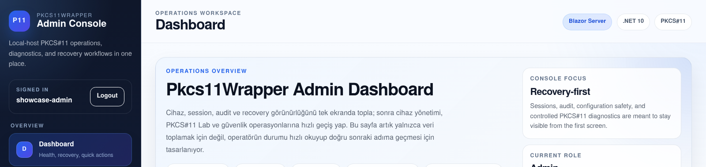
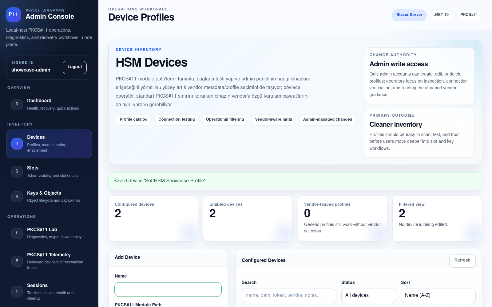
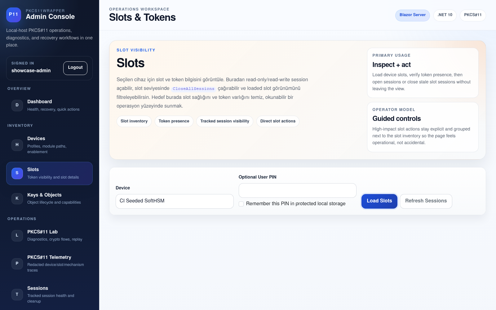
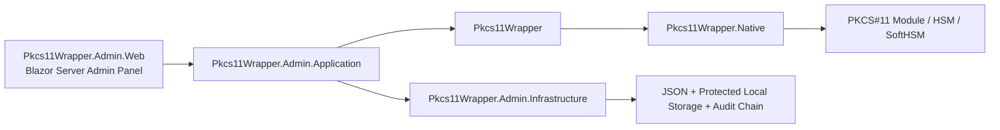

# Pkcs11Wrapper

[](https://github.com/EbubekirERGUN/Pkcs11Wrapper/actions/workflows/ci.yml)
[](https://github.com/EbubekirERGUN/Pkcs11Wrapper/actions/workflows/benchmarks.yml)
[](https://dotnet.microsoft.com/)
[](#platform--dogrulama-durumu)
[](#platform--dogrulama-durumu)
[](#blazor-server-admin-panel)
[](#one-cikan-ozellikler)

Modern bir **.NET 10 PKCS#11 wrapper**; Linux tarafında güçlü doğrulama, Windows desteği, PKCS#11 v3 interface/message farkındalığı ve HSM operasyonları için büyüyen bir **Blazor Server admin paneli** ile birlikte gelir.

> İngilizce README: [README.md](README.md)

## Admin panel vitrin görüntüleri

<p align="center">
  
</p>

<p align="center">
  
  
</p>

Admin panelin güncel ve küçük bir vitrin kesiti:

- **Dashboard** — recovery-first operasyon özeti ve role-aware konsol çerçevesi
- **Devices** — HSM profil envanteri, bağlantı yönetişimi akışı ve vendor-aware yönetim yüzeyi
- **Slots** — key/session işlerine geçmeden önce token görünürlüğü ve slot seviyesinde operasyon giriş noktası

Capture akışı ve doğrulama notları için: [docs/showcase/2026-04-final/README.md](docs/showcase/2026-04-final/README.md)

## Bu proje neden var?

PKCS#11 entegrasyonları güçlüdür ama modern .NET uygulamalarında kullanımı çoğu zaman yorucu ve dağınıktır. `Pkcs11Wrapper` şu alanlar için daha temiz, daha açık, daha test edilebilir ve daha üretim odaklı bir temel sunmayı hedefler:

- HSM ve akıllı kart entegrasyonları
- imzalama / doğrulama / anahtar yaşam döngüsü operasyonları
- Windows + Linux dağıtımları
- vendor PKCS#11 uyumluluk çalışmaları
- admin panel üzerinden operasyonel görünürlük

## Öne çıkan özellikler

### Core wrapper

- Yerel PKCS#11 / Cryptoki modülü üzerinde açık ve kontrollü managed API
- .NET 10 odaklı mimari
- Linux + Windows desteği
- NativeAOT farkındalığı
- PKCS#11 v3 interface discovery desteği
- Modül destekliyorsa PKCS#11 v3 message API desteği
- Yapılandırılabilir initialize akışı (`CK_C_INITIALIZE_ARGS`, mutex callbacks, OS locking)

### Doğrulama ve mühendislik disiplini

- Fixture-backed SoftHSM regression suite
- SoftHSM-for-Windows ile Windows runtime regression yolu
- Linux üzerinde NativeAOT smoke doğrulaması
- BenchmarkDotNet tabanlı performans baseline'ı ve periyodik benchmark workflow'u
- Opsiyonel vendor regression lane
- Release verification script'i ve pack metadata

### Admin panel

- Blazor Server tabanlı admin arayüzü
- `viewer` / `operator` / `admin` rolleriyle yerel kimlik doğrulama
- HSM cihaz profili yönetimi + yapılandırma export/import
- slot/token inceleme
- key/object listeleme, detay, düzenleme, kopyalama, generate, import ve destroy akışları
- tracked session görünürlüğü ve kontrolü (`login` / `logout` / `cancel` / `close-all` + invalidation görünürlüğü)
- PKCS#11 Lab teşhis ekranı, kripto denemeleri, obje akışları ve scenario replay yardımcıları
- protected PIN cache + append-only chained audit log integrity

## Platform / doğrulama durumu

| Alan | Durum | Not |
| --- | --- | --- |
| Linux | ✅ | en derin runtime doğrulama yolu, fixture-backed regression + NativeAOT smoke |
| Windows | ✅ | SoftHSM-for-Windows + OpenSC ile runtime regression |
| PKCS#11 v3 interface discovery | ✅ | modül export etmiyorsa capability-gated davranış |
| PKCS#11 v3 message API'leri | ✅ | managed/API desteği var; runtime modül desteğine bağlı |
| Admin panel | ✅ | auth, local users, config transfer, audit integrity ve PKCS#11 Lab içeren işlevsel Blazor Server yönetim yüzeyi |
| Vendor regression lane | ✅ | opsiyonel non-SoftHSM doğrulama yolu |

## Depo mimarisi



## Hızlı başlangıç

### 1) Kütüphaneyi kullan

```bash
dotnet add package Pkcs11Wrapper
```

```csharp
using Pkcs11Wrapper;

using Pkcs11Module module = Pkcs11Module.Load("/path/to/pkcs11/module");
module.Initialize(new Pkcs11InitializeOptions(Pkcs11InitializeFlags.UseOperatingSystemLocking));

int slotCount = module.GetSlotCount();
Console.WriteLine($"Discovered {slotCount} slot(s).");
```

### 2) Admin paneli çalıştır

```bash
cd src/Pkcs11Wrapper.Admin.Web
dotnet run
```

İlk çalıştırmada panel, `App_Data/bootstrap-admin.txt` altında yerel bootstrap admin credential dosyasını oluşturur.

### 3) Doğrulamayı çalıştır

Linux:

```bash
./eng/run-regression-tests.sh
./eng/run-smoke-aot.sh
./eng/run-benchmarks.sh
```

Windows PowerShell:

```powershell
.\eng\setup-softhsm-fixture.ps1 -DownloadPortable -EnvFilePath "$env:TEMP\pkcs11-fixture.ps1"
.\eng\run-regression-tests.ps1 -UseExistingEnv -EnvFilePath "$env:TEMP\pkcs11-fixture.ps1"
.\eng\run-smoke.ps1 -UseExistingEnv -EnvFilePath "$env:TEMP\pkcs11-fixture.ps1"
.\eng\run-benchmarks.ps1 -UseExistingEnv -EnvFilePath "$env:TEMP\pkcs11-fixture.ps1"
```

## Performans benchmark'ları

Depoda artık performans işlerini tahminle değil ölçümle takip etmek için özel bir `BenchmarkDotNet` suite'i var.

Şu an benchmark kapsamı şunları içeriyor:

- managed template/provisioning helper'ları
- module lifecycle + mechanism discovery
- session open/login/info akışları
- object lookup, büyük slot page browse, attribute read, create/update/destroy
- AES key generate ve RSA keypair generate
- random, digest, encrypt, decrypt, sign, verify

Güncel commitlenmiş Linux + SoftHSM baseline (`docs/benchmarks/latest-linux-softhsm.md`):

- Yayınlanan benchmark tarihi (UTC): **2026-04-02 10:17**
- Benchmark ortamı: **Arch Linux + SoftHSM + .NET SDK 10.0.201 / Runtime 10.0.5**

| Benchmark | Baseline |
| --- | ---: |
| `LoadInitializeGetInfoFinalizeDispose` | `1.934 μs` |
| `OpenReadOnlySessionAndGetInfo` | `8.036 μs` |
| `GenerateRandom32` | `149.094 ns` |
| `EncryptAesCbcPad_1KiB` | `6.352 μs` |
| `VerifySha256RsaPkcs_1KiB` | `19.607 μs` |
| `BrowseFirstDataObjectPage64Of256` | `49.451 μs` |
| `GenerateDestroyRsaKeyPair` | `25.145 ms` |

Detaylı benchmark rehberi ve tekrar çalıştırma akışı:

- [docs/benchmarks.md](docs/benchmarks.md)
- [docs/benchmarks/latest-linux-softhsm.md](docs/benchmarks/latest-linux-softhsm.md)

## Blazor Server admin panel

Admin panel, core wrapper'ın içine gömülmek yerine **kütüphanenin üstünde çalışan operasyon katmanı** olarak tasarlandı.

Şu anki yetenekler:

- device profile CRUD
- `viewer` / `operator` / `admin` rolleriyle local cookie auth
- local user management, password rotation ve bootstrap credential lifecycle kontrolleri
- PKCS#11 module connection test
- slot ve token görüntüleme
- key/object listeleme, detay, düzenleme, kopyalama, generate, import, destroy akışları
- tracked session login/logout/cancel kontrolleri + slot-level close-all
- session health/invalidation görünürlüğü
- tekrar eden işlemler için protected PIN cache
- device-profile configuration export/import
- teşhis, kripto operasyonları, object inspection, wrap/unwrap, raw attribute read ve scenario replay için PKCS#11 Lab
- integrity verification içeren chained audit entries

## Doküman haritası

- [docs/development.md](docs/development.md) - repo yapısı, geliştirme akışı, doğrulama yapısı
- [docs/compatibility-matrix.md](docs/compatibility-matrix.md) - desteklenen capability alanları ve mevcut sınırlar
- [docs/windows-local-setup.md](docs/windows-local-setup.md) - yerel Windows fixture/bootstrap akışı
- [docs/benchmarks.md](docs/benchmarks.md) - benchmark kapsamı, tekrar çalıştırma akışı, periyodik takip modeli
- [docs/benchmarks/latest-linux-softhsm.md](docs/benchmarks/latest-linux-softhsm.md) - güncel commitlenmiş Linux benchmark baseline'ı
- [docs/admin-ops-recovery.md](docs/admin-ops-recovery.md) - lokal admin-panel operasyon ve recovery rehberi
- [docs/vendor-regression.md](docs/vendor-regression.md) - vendor uyumluluk profili ve env sözleşmesi
- [docs/luna-integration.md](docs/luna-integration.md) - wrapper, admin panel, smoke ve vendor regression için pratik Thales Luna client/module kurulum rehberi
- [docs/luna-compatibility-audit.md](docs/luna-compatibility-audit.md) - Thales Luna genel dokümantasyonuna göre mevcut wrapper/admin/runtime kapsamı uyumluluk denetimi
- [docs/luna-vendor-extension-design.md](docs/luna-vendor-extension-design.md) - gelecekteki Luna-only `CA_*` desteği için önerilen paket/sınır/yükleme/test stratejisi
- [docs/vendor-audit-integration.md](docs/vendor-audit-integration.md) - wrapper telemetry ile vendor-native HSM audit farkını ve Thales Luna için CLI/syslog/export/API entegrasyon seçeneklerini değerlendiren not
- [docs/smoke.md](docs/smoke.md) - smoke sample davranışı ve troubleshooting
- [docs/release.md](docs/release.md) - release checklist ve packaging disiplini
- [docs/versioning.md](docs/versioning.md) - merkezi versioning modeli ve tag stratejisi
- [docs/admin-panel-roadmap.md](docs/admin-panel-roadmap.md) - admin panel yol haritası
- [docs/github-showcase.md](docs/github-showcase.md) - önerilen GitHub description/topics/social preview metinleri
- [docs/showcase/2026-04-final/README.md](docs/showcase/2026-04-final/README.md) - commitlenmiş admin-panel vitrin görselleri + capture akışı

## Güncel sınırlar

- Tam PKCS#11 davranışı hedef token / HSM / vendor policy’ye bağlıdır.
- Import/edit/copy override gibi bazı gelişmiş operasyonlar, wrapper desteklese bile token policy yüzünden reddedilebilir.
- Mevcut admin auth/security modeli bilinçli olarak tek-host/lokal kullanım odaklıdır; external IdP/IAM, MFA ve merkezi secret governance henüz uygulamanın parçası değildir.
- En derin NativeAOT doğrulama hâlâ Linux tarafındadır.
- PKCS#11 v3 runtime davranışı, hedef modülün ilgili v3 interface yüzeyini gerçekten export etmesine bağlıdır.

## Katkı vermek isteyenler için

Wrapper, validation matrix, Windows/Linux desteği veya admin panel UX tarafında katkı vermek istersen şuralara bak:

- [CONTRIBUTING.md](CONTRIBUTING.md)
- [SECURITY.md](SECURITY.md)
- `.github/ISSUE_TEMPLATE/` altındaki issue template’ler

## Kısa roadmap özeti

Yakın dönem odak alanları:

- admin panel için sonraki polish dilimleri (dashboard/widget genişletmeleri, tablo ergonomisi, daha yaygın filtering/sorting/paging)
- PKCS#11 v3-capable modüller için daha güçlü vendor-backed runtime doğrulama
- periyodik benchmark tekrarları ve en güncel yayınlanan baseline'ın tazelenmesi
- daha iyi GitHub vitrin materyalleri (ekran görüntüsü / demo media / release notes)

## Projenin konumu

`Pkcs11Wrapper` özellikle şu tür ekipler için pratik bir temel olmayı hedefler:

- e-imza / sertifika iş akışları
- HSM tabanlı imzalama servisleri
- güvenli anahtar yönetim araçları
- .NET sistemlerinde PKCS#11 entegrasyon katmanı
- token / slot / object yaşam döngüsü yönetimi için operasyon panelleri

PKCS#11, HSM, akıllı kart veya kriptografik altyapı alanında çalışıyorsan, bu proje sadece ince bir P/Invoke örneği değil; gerçek dünyaya dönük bir temel olmayı amaçlıyor.
