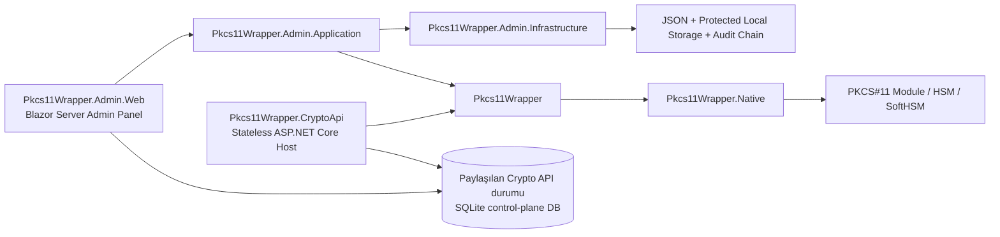

# Pkcs11Wrapper

[](https://github.com/EbubekirERGUN/Pkcs11Wrapper/actions/workflows/ci.yml)
[](https://github.com/EbubekirERGUN/Pkcs11Wrapper/actions/workflows/release.yml)
[](https://github.com/EbubekirERGUN/Pkcs11Wrapper/actions/workflows/benchmarks.yml)
[](https://dotnet.microsoft.com/)
[](#platform--dogrulama-durumu)
[](#platform--dogrulama-durumu)
[](#blazor-server-admin-panel)
[](#one-cikan-ozellikler)

Modern bir **.NET 10 PKCS#11 wrapper**; Linux tarafında güçlü doğrulama, Windows desteği, PKCS#11 v3 interface/message farkındalığı ve HSM operasyonları için ayrı **admin paneli** ile **Crypto API** host'ları içerir.

> İngilizce README: [README.md](README.md)

## Admin panel vitrin görüntüleri

<p align="center">
  
</p>

<p align="center">
  
  
</p>

Admin panelin güncel ve küçük bir vitrin kesiti:

- **Dashboard** — recovery-first operasyon özeti ve role-aware konsol çerçevesi
- **Devices** — HSM profil envanteri, bağlantı yönetişimi akışı ve vendor-aware yönetim yüzeyi
- **Slots** — canlı yüklenmiş slot/token görünürlüğü ve key/session işlerine geçmeden önce slot seviyesinde operasyon giriş noktası

Capture akışı ve doğrulama notları için: [docs/showcase/2026-04-final/README.md](docs/showcase/2026-04-final/README.md)

Telemetry, security/admin recovery ve Crypto API Access yüzeyleri ekran görüntüsü sayısını şişirmek yerine aşağıdaki README bölümlerinde ve bağlı dokümanlarda temsil ediliyor.

## Bu proje neden var?

PKCS#11 entegrasyonları güçlüdür ama modern .NET uygulamalarında kullanımı çoğu zaman yorucu ve dağınıktır. `Pkcs11Wrapper` şu alanlar için daha temiz, daha açık, daha test edilebilir ve daha üretim odaklı bir temel sunmayı hedefler:

- HSM ve akıllı kart entegrasyonları
- imzalama / doğrulama / anahtar yaşam döngüsü operasyonları
- Windows + Linux dağıtımları
- vendor PKCS#11 uyumluluk çalışmaları
- admin panel üzerinden operasyonel görünürlük
- gelecekteki makineye dönük kripto servisleri için temiz bir başlangıç noktası

## Öne çıkan özellikler

### Core wrapper

- Yerel PKCS#11 / Cryptoki modülü üzerinde açık ve kontrollü managed API
- .NET 10 odaklı mimari
- Linux + Windows desteği
- NativeAOT farkındalığı
- PKCS#11 v3 interface discovery desteği
- Modül destekliyorsa PKCS#11 v3 message API desteği
- Yapılandırılabilir initialize akışı (`CK_C_INITIALIZE_ARGS`, mutex callbacks, OS locking)

### Doğrulama ve mühendislik disiplini

- Fixture-backed SoftHSM regression suite
- SoftHSM-for-Windows ile Windows runtime regression yolu
- Linux üzerinde NativeAOT smoke doğrulaması
- BenchmarkDotNet tabanlı performans baseline'ı ve periyodik benchmark workflow'u
- Opsiyonel vendor regression lane
- preflight kontrolleri, artifact yayını, opsiyonel NuGet push'u, SourceLink/sembol paketi doğrulaması ve release verification script'i içeren tagged release akışı

### Admin panel

- Blazor Server tabanlı admin arayüzü
- `viewer` / `operator` / `admin` rolleriyle yerel kimlik doğrulama
- HSM cihaz profili yönetimi + yapılandırma export/import
- opsiyonel katalog metadatası ve kurulum ipuçlarıyla vendor-aware cihaz profilleri
- slot/token inceleme
- key/object listeleme, detay, düzenleme, kopyalama, generate, import ve destroy akışları
- tracked session görünürlüğü ve kontrolü (`login` / `logout` / `cancel` / `close-all` + invalidation görünürlüğü)
- PKCS#11 Lab teşhis ekranı, kripto denemeleri, obje akışları ve scenario replay yardımcıları
- redakte edilmiş device / slot / mechanism / status filtreleri, retention/export kontrolleri ve audit korelasyon bağlantıları içeren PKCS#11 telemetry görüntüleyicisi
- paylaşılan store üstündeki uygulamalar, API anahtarları, alias'lar, policy'ler ve binding'ler için Crypto API Access kontrol düzlemi
- protected PIN cache + append-only chained audit log integrity

### Crypto API host iskeleti

- `src/Pkcs11Wrapper.CryptoApi` altında ayrı ASP.NET Core host
- admin dashboard'dan ayrı, stateless ve machine-facing sınır
- servis kimliği, API base path, PKCS#11 runtime ve shared persistence için DI/config binding
- `/health/live` + `/health/ready` endpoint'leri; readiness, yapılandırılan PKCS#11 modülü ile varsa shared persistence sınırını doğrular
- gelişen machine-facing sözleşme için `/api/v1`, `/api/v1/runtime`, `/api/v1/operations`, `POST /api/v1/operations/authorize`, `/api/v1/shared-state` ve `/api/v1/auth/self` route alanı
- çoklu instance senaryoları için API client/anahtarları, key alias'ları, policy'ler ve policy binding'leri taşıyan pragmatik shared SQLite persistence
- üretilen API anahtarı secret'larının yalnızca bir kez gösterildiği, hash olarak saklandığı ve admin panelinden alias/policy/binding yönetimiyle eşleşebildiği access-control dilimi
- machine-facing host'u tenant portalına çevirmeden uygulamalar, alias'lar, policy'ler ve binding'ler için admin-panel/shared-store control-plane modeli
- hedef dağıtım modeli: **bir admin dashboard + çok sayıda stateless Crypto API instance'ı**

## Platform / doğrulama durumu

| Alan | Durum | Not |
| --- | --- | --- |
| Linux | ✅ | en derin runtime doğrulama yolu, fixture-backed regression + NativeAOT smoke |
| Windows | ✅ | SoftHSM-for-Windows + OpenSC ile fixture-backed runtime regression ve `win-x64` NativeAOT smoke |
| PKCS#11 v3 interface discovery | ✅ | modül export etmiyorsa capability-gated davranış |
| PKCS#11 v3 message API'leri | ✅ | managed/API desteği var; runtime modül desteğine bağlı |
| Admin panel | ✅ | auth, local users, config transfer, audit integrity, PKCS#11 Lab, telemetry ve Crypto API Access control-plane akışları içeren işlevsel Blazor Server yönetim yüzeyi |
| Crypto API host iskeleti | ✅ | DI/config, servis dokümanları, health/readiness, shared SQLite tabanlı auth/policy persistence ve ilk alias-routing/policy-enforcement dilimini içeren stateless ASP.NET Core host |
| Vendor regression lane | ✅ | opsiyonel non-SoftHSM doğrulama yolu |

## Depo mimarisi



## Hızlı başlangıç

### 1) Kütüphaneyi kullan

```bash
dotnet add package Pkcs11Wrapper
```

```csharp
using Pkcs11Wrapper;

using Pkcs11Module module = Pkcs11Module.Load("/path/to/pkcs11/module");
module.Initialize(new Pkcs11InitializeOptions(Pkcs11InitializeFlags.UseOperatingSystemLocking));

int slotCount = module.GetSlotCount();
Console.WriteLine($"Discovered {slotCount} slot(s).");
```

### 2) Admin paneli çalıştır

```bash
cd src/Pkcs11Wrapper.Admin.Web
dotnet run
```

Kaynak ağacı üzerinden yerel geliştirmede ilk çalıştırma, `App_Data/bootstrap-admin.txt` altında bootstrap admin credential dosyasını üretir.

Admin host `Development` ortamında çalışırken yalnızca gerçek admin HTTP endpoint'lerini belgeleyen OpenAPI dokümanı `/openapi/v1.json` altında, Swagger UI ise `/swagger` altında açılır. Bu route'lar üretim dağıtımlarında varsayılan olarak kapalı tutulur; böylece ekstra bir keşif/test yüzeyi açılmaz.

CI/otomasyon/container senaryolarında runtime storage root'u, bootstrap credential'ı, ilk PKCS#11 module path'i ve runtime davranışını dışarıdan verebilirsin:

```bash
export AdminStorage__DataRoot=/tmp/pkcs11wrapper-admin-data
export LocalAdminBootstrap__UserName=ci-admin
export LocalAdminBootstrap__Password='AdminE2E!Pass123'
export AdminBootstrapDevice__Name='SoftHSM demo'
export AdminBootstrapDevice__ModulePath=/usr/lib/softhsm/libsofthsm2.so
export AdminRuntime__DisableHttpsRedirection=true
```

### 2b) Crypto API host iskeletini çalıştır

```bash
cd src/Pkcs11Wrapper.CryptoApi
export CryptoApiRuntime__ModulePath=/usr/lib/libsofthsm2.so
export CryptoApiRuntime__DisableHttpsRedirection=true
export CryptoApiSharedPersistence__ConnectionString='Data Source=/tmp/pkcs11wrapper-cryptoapi-shared.db'
dotnet run
```

Kullanışlı endpoint'ler:

- `/`
- `/health/live`
- `/health/ready`
- `/api/v1`
- `/api/v1/runtime`
- `/api/v1/operations`
- `/api/v1/shared-state`
- `X-Api-Key-Id` + `X-Api-Key-Secret` ile `/api/v1/auth/self`
- `X-Api-Key-Id` + `X-Api-Key-Secret` ile `POST /api/v1/operations/authorize` ve `{ "keyAlias": "payments-signer", "operation": "sign" }`

Admin dashboard aynı `CryptoApiSharedPersistence:ConnectionString` değerine bağlanırsa, Crypto API client/alias/policy/binding verisinin kullandığı shared control-plane modeli üzerinde çalışabilir.

Sınır, çalışma modeli ve dağıtım rehberi için:

- [docs/crypto-api-deployment.md](docs/crypto-api-deployment.md)
- [docs/crypto-api-host.md](docs/crypto-api-host.md)
- [docs/security-review-issue-112.md](docs/security-review-issue-112.md)

### 3) Doğrulamayı çalıştır

Linux:

```bash
./eng/run-regression-tests.sh
./eng/run-admin-e2e.sh
./eng/run-smoke-aot.sh
./eng/run-benchmarks.sh
```

Windows PowerShell:

```powershell
.\eng\setup-softhsm-fixture.ps1 -DownloadPortable -EnvFilePath "$env:TEMP\pkcs11-fixture.ps1"
.\eng\run-regression-tests.ps1 -UseExistingEnv -EnvFilePath "$env:TEMP\pkcs11-fixture.ps1"
.\eng\run-smoke.ps1 -UseExistingEnv -EnvFilePath "$env:TEMP\pkcs11-fixture.ps1" -Strict
.\eng\run-smoke-aot.ps1 -UseExistingEnv -EnvFilePath "$env:TEMP\pkcs11-fixture.ps1" -Strict
.\eng\run-benchmarks.ps1 -UseExistingEnv -EnvFilePath "$env:TEMP\pkcs11-fixture.ps1"
```

## Performans benchmark'ları

Depoda artık performans işlerini tahminle değil ölçümle takip etmek için özel bir `BenchmarkDotNet` suite'i var.

Şu an benchmark kapsamı şunları içeriyor:

- managed template/provisioning helper'ları
- module lifecycle + mechanism discovery
- session open/login/info akışları
- object lookup, büyük slot page browse, attribute read, create/update/destroy
- AES key generate ve RSA keypair generate
- random, digest, encrypt, decrypt, sign, verify

Güncel commitlenmiş Linux + SoftHSM baseline (`docs/benchmarks/latest-linux-softhsm.md`):

- Yayınlanan benchmark tarihi (UTC): **2026-04-02 10:17**
- Benchmark ortamı: **Arch Linux + SoftHSM + .NET SDK 10.0.201 / Runtime 10.0.5**

| Benchmark | Baseline |
| --- | ---: |
| `LoadInitializeGetInfoFinalizeDispose` | `1.934 μs` |
| `OpenReadOnlySessionAndGetInfo` | `8.036 μs` |
| `GenerateRandom32` | `149.094 ns` |
| `EncryptAesCbcPad_1KiB` | `6.352 μs` |
| `VerifySha256RsaPkcs_1KiB` | `19.607 μs` |
| `BrowseFirstDataObjectPage64Of256` | `49.451 μs` |
| `GenerateDestroyRsaKeyPair` | `25.145 ms` |

Detaylı benchmark rehberi ve tekrar çalıştırma akışı:

- [docs/benchmarks.md](docs/benchmarks.md)
- [docs/benchmarks/latest-linux-softhsm.md](docs/benchmarks/latest-linux-softhsm.md)

## Blazor Server admin panel

Admin panel, core wrapper'ın içine gömülmek yerine **kütüphanenin üstünde çalışan operasyon katmanı** olarak tasarlandı.

Şu anki yetenekler:

- opsiyonel vendor metadata/profile selection ile device profile CRUD
- `viewer` / `operator` / `admin` rolleriyle local cookie auth
- local user management, password rotation ve bootstrap credential lifecycle kontrolleri
- PKCS#11 module connection test
- vendor-tagged profile seçildiğinde Devices, Slots, Keys ve PKCS#11 Lab üzerinde vendor-aware setup hint/caveat görünürlüğü
- slot ve token görüntüleme
- key/object listeleme, detay, düzenleme, kopyalama, generate, import, destroy akışları
- tracked session login/logout/cancel kontrolleri + slot-level close-all
- session health/invalidation görünürlüğü
- tekrar eden işlemler için protected PIN cache
- device-profile configuration export/import
- teşhis, kripto operasyonları, object inspection, wrap/unwrap, raw attribute read ve scenario replay için PKCS#11 Lab
- redakte edilmiş wrapper-level operasyon izleri, bounded retention/export kontrolleri ve audit korelasyonu için PKCS#11 telemetry görüntüleyicisi
- shared-store application onboarding, API-key lifecycle, alias routing, policy tanımları ve binding yönetimi için Crypto API Access yüzeyi
- integrity verification içeren chained audit entries

## Doküman haritası

- [docs/development.md](docs/development.md) - repo yapısı, geliştirme akışı, doğrulama yapısı
- [docs/compatibility-matrix.md](docs/compatibility-matrix.md) - desteklenen capability alanları ve mevcut sınırlar
- [docs/windows-local-setup.md](docs/windows-local-setup.md) - yerel Windows fixture/bootstrap akışı
- [docs/benchmarks.md](docs/benchmarks.md) - benchmark kapsamı, tekrar çalıştırma akışı, periyodik takip modeli
- [docs/benchmarks/latest-linux-softhsm.md](docs/benchmarks/latest-linux-softhsm.md) - güncel commitlenmiş Linux benchmark baseline'ı
- [docs/admin-container.md](docs/admin-container.md) - standalone admin container dağıtım rehberi, volume yerleşimi, PKCS#11 mount kalıpları ve local/dev ile production-safe sınırlar
- [docs/crypto-api-deployment.md](docs/crypto-api-deployment.md) - tek dashboard + çoklu Crypto API instance topolojisi, ölçekleme beklentileri, shared-state sınırları ve container/deployment rehberi
- [docs/crypto-api-host.md](docs/crypto-api-host.md) - stateless Crypto API host sınırı, çalışma modeli, konfigürasyon ve mevcut iskelet endpoint'leri
- `deploy/container/admin-panel.env.example` - standalone admin container yolu için başlangıç env şablonu
- `deploy/container/crypto-api.env.example` - operator-built Crypto API process/container wrapper'ları için başlangıç env şablonu
- [deploy/compose/softhsm-lab/README.md](deploy/compose/softhsm-lab/README.md) - admin panel + SoftHSM backend için local/dev/lab compose yığını
- [docs/security-review-issue-112.md](docs/security-review-issue-112.md) - issue #112 için ürün yüzeyi güvenlik incelemesi, yapılan sertleştirmeler ve açık kalan sınırlar
- [docs/admin-ops-recovery.md](docs/admin-ops-recovery.md) - lokal admin-panel operasyon ve recovery rehberi
- [docs/vendor-regression.md](docs/vendor-regression.md) - vendor uyumluluk profili ve env sözleşmesi
- [docs/luna-integration.md](docs/luna-integration.md) - wrapper, admin panel, smoke ve vendor regression için pratik Thales Luna client/module kurulum rehberi
- [docs/luna-compatibility-audit.md](docs/luna-compatibility-audit.md) - Thales Luna genel dokümantasyonuna göre mevcut wrapper/admin/runtime kapsamı uyumluluk denetimi
- [docs/cloudhsm-integration.md](docs/cloudhsm-integration.md) - wrapper ve admin panel kullanımı için pratik AWS CloudHSM Client SDK 5 kurulum rehberi
- [docs/cloudhsm-compatibility-audit.md](docs/cloudhsm-compatibility-audit.md) - AWS CloudHSM standart PKCS#11 uyumluluğunun mevcut wrapper/admin/runtime kapsamıyla public-doc denetimi
- [docs/azure-cloud-hsm-integration.md](docs/azure-cloud-hsm-integration.md) - wrapper/admin panel kullanımı ve Cloud HSM vs Managed HSM sınırı için pratik Azure Cloud HSM SDK/PKCS#11 kurulum rehberi
- [docs/azure-cloud-hsm-compatibility-audit.md](docs/azure-cloud-hsm-compatibility-audit.md) - Azure Cloud HSM'in direct PKCS#11 uyumunun mevcut wrapper/admin/runtime kapsamıyla public-doc denetimi
- [docs/google-cloud-hsm-integration.md](docs/google-cloud-hsm-integration.md) - wrapper ve admin panel kullanımı için Google Cloud KMS / Cloud HSM via kmsp11 kurulum rehberi
- [docs/google-cloud-hsm-compatibility-audit.md](docs/google-cloud-hsm-compatibility-audit.md) - Google Cloud HSM'in dolaylı kmsp11 PKCS#11 yolunun mevcut wrapper/admin/runtime kapsamıyla public-doc denetimi
- [docs/ibm-cloud-hpcs-integration.md](docs/ibm-cloud-hpcs-integration.md) - wrapper/admin panel kullanımı ve direct-vs-GREP11 sınırı için IBM Cloud Hyper Protect Crypto Services EP11 PKCS#11 kurulum rehberi
- [docs/ibm-cloud-hpcs-compatibility-audit.md](docs/ibm-cloud-hpcs-compatibility-audit.md) - IBM Cloud HPCS direct PKCS#11 uyumunun mevcut wrapper/admin/runtime kapsamıyla public-doc denetimi
- [docs/oci-dedicated-kms-integration.md](docs/oci-dedicated-kms-integration.md) - wrapper/admin panel kullanımı ve direct-vs-OCI-Vault sınırı için Oracle OCI Dedicated KMS kurulum rehberi
- [docs/oci-dedicated-kms-compatibility-audit.md](docs/oci-dedicated-kms-compatibility-audit.md) - Oracle OCI Dedicated KMS PKCS#11 uyumunun mevcut wrapper/admin/runtime kapsamıyla public-doc denetimi
- [docs/luna-vendor-extension-design.md](docs/luna-vendor-extension-design.md) - gelecekteki Luna-only `CA_*` desteği için önerilen paket/sınır/yükleme/test stratejisi
- [docs/vendor-audit-integration.md](docs/vendor-audit-integration.md) - wrapper telemetry ile vendor-native HSM audit farkını ve Thales Luna için CLI/syslog/export/API entegrasyon seçeneklerini değerlendiren not
- [docs/smoke.md](docs/smoke.md) - smoke sample davranışı ve troubleshooting
- [docs/telemetry-redaction.md](docs/telemetry-redaction.md) - PKCS#11 telemetry redaction politikası
- [docs/telemetry-integrations.md](docs/telemetry-integrations.md) - `ILogger` ve `ActivitySource` / OpenTelemetry entegrasyon rehberi
- [docs/admin-telemetry-operations.md](docs/admin-telemetry-operations.md) - admin telemetry retention, rotation, export ve audit-correlation operasyonları
- [docs/release.md](docs/release.md) - release checklist ve packaging disiplini
- [docs/versioning.md](docs/versioning.md) - merkezi versioning modeli ve tag stratejisi
- [docs/admin-panel-roadmap.md](docs/admin-panel-roadmap.md) - admin panel yol haritası
- [docs/github-showcase.md](docs/github-showcase.md) - önerilen GitHub description/topics/social preview metinleri
- [docs/showcase/2026-04-final/README.md](docs/showcase/2026-04-final/README.md) - commitlenmiş admin-panel vitrin görselleri + capture akışı

## Güncel sınırlar

- Tam PKCS#11 davranışı hedef token / HSM / vendor policy’ye bağlıdır.
- Import/edit/copy override gibi bazı gelişmiş operasyonlar, wrapper desteklese bile token policy yüzünden reddedilebilir.
- Mevcut admin auth/security modeli bilinçli olarak tek-host/lokal kullanım odaklıdır; external IdP/IAM, MFA ve merkezi secret governance henüz uygulamanın parçası değildir.
- Yeni Crypto API host'u şu an bir scaffold sınırıdır: health/readiness ve route alanı gerçektir, ancak public kripto request contract'ları bilinçli olarak henüz finalize edilmemiştir.
- En derin NativeAOT doğrulama hâlâ Linux tarafındadır.
- PKCS#11 v3 runtime davranışı, hedef modülün ilgili v3 interface yüzeyini gerçekten export etmesine bağlıdır.

## Katkı vermek isteyenler için

Wrapper, validation matrix, Windows/Linux desteği veya admin panel UX tarafında katkı vermek istersen şuralara bak:

- [CONTRIBUTING.md](CONTRIBUTING.md)
- [SECURITY.md](SECURITY.md)
- `.github/ISSUE_TEMPLATE/` altındaki issue template’ler

## Kısa roadmap özeti

Yakın dönem odak alanları:

- admin panel için sonraki polish dilimleri (dashboard/widget genişletmeleri, tablo ergonomisi, daha yaygın filtering/sorting/paging)
- yeni stateless host iskeleti üzerinde ilk somut machine-facing Crypto API contract'larını tanımlamak ve uygulamak
- PKCS#11 v3-capable modüller için daha güçlü vendor-backed runtime doğrulama
- periyodik benchmark tekrarları ve en güncel yayınlanan baseline'ın tazelenmesi
- daha iyi GitHub vitrin materyalleri (ekran görüntüsü / demo media / release notes)

## Projenin konumu

`Pkcs11Wrapper` özellikle şu tür ekipler için pratik bir temel olmayı hedefler:

- e-imza / sertifika iş akışları
- HSM tabanlı imzalama servisleri
- güvenli anahtar yönetim araçları
- .NET sistemlerinde PKCS#11 entegrasyon katmanı
- token / slot / object yaşam döngüsü yönetimi için operasyon panelleri

PKCS#11, HSM, akıllı kart veya kriptografik altyapı alanında çalışıyorsan, bu proje sadece ince bir P/Invoke örneği değil; gerçek dünyaya dönük bir temel olmayı amaçlıyor.
