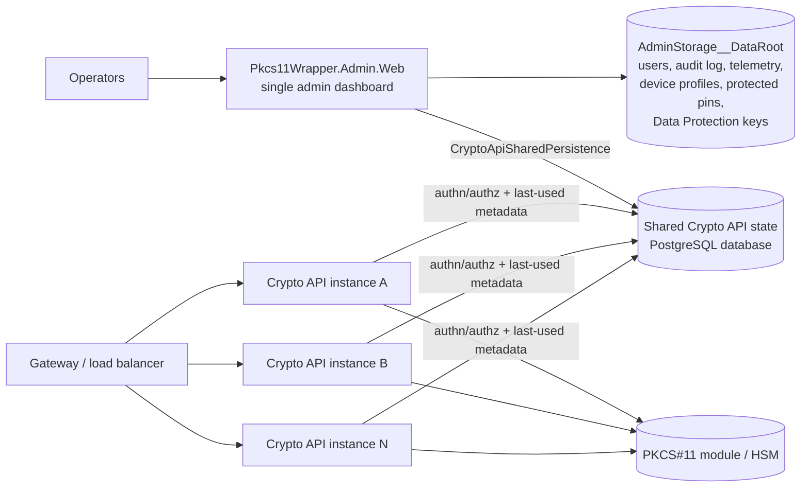

# Single-dashboard + multi-instance Crypto API deployment

This guide documents the **current supported operating model** for the repository's admin/dashboard and Crypto API projects:

> **one admin dashboard + many stateless Crypto API instances**

Keep this guide operator-focused:

- where state lives
- what each component owns
- how to scale the Crypto API without turning it into a per-node snowflake
- what to mount or persist in containerized deployments
- what is deliberately **not** provided by the repo yet

For host/API surface details, see [docs/crypto-api-host.md](docs/crypto-api-host.md).
For the standalone admin image contract, see [docs/admin-container.md](docs/admin-container.md).

## What the current topology is



Operationally:

- run **one** `Pkcs11Wrapper.Admin.Web` instance per deployment boundary
- run **one or more** `Pkcs11Wrapper.CryptoApi` instances behind your gateway/load balancer
- point the admin dashboard and every Crypto API instance at the **same** `CryptoApiSharedPersistence:ConnectionString`
- keep the admin dashboard's own storage root **separate** from the shared Crypto API state database

## Shared persistence baseline

The repo now standardizes on **Postgres** for the Crypto API shared control plane.

That means:

- the admin dashboard and every Crypto API instance should point at the **same** PostgreSQL database when they share one control plane
- local/dev/lab flows use the same backend family as production-oriented deployments
- Redis remains optional acceleration only; it never replaces the relational source of truth
- operators no longer need to evaluate SQLite shared-volume semantics before deciding whether a topology is supported

## Responsibilities by component

### `Pkcs11Wrapper.Admin.Web` owns operator workflows

The admin dashboard is the operator-facing boundary.

It owns:

- local admin sign-in and cookies
- admin user records
- append-only audit log
- admin-side PKCS#11 telemetry retention/export files
- device profiles
- protected PIN storage
- lab templates
- ASP.NET Core Data Protection keys

That mutable app state lives under `AdminStorage__DataRoot`.
In container deployments, the repository image defaults that to `/var/lib/pkcs11wrapper-admin`.
When the dashboard is also configured with `CryptoApiSharedPersistence`, its **Crypto API Access** workflow operates against the same shared client/key control-plane data consumed by the API instances.

Treat this as **admin-local state**, not as the shared multi-instance Crypto API database.

### `Pkcs11Wrapper.CryptoApi` owns machine-facing request handling

The Crypto API host is intentionally thin.

It owns:

- HTTP request handling for machine clients
- API-key authentication against the shared store
- alias/policy authorization against the shared store
- request-time PKCS#11 execution using the configured module path and optional user PIN
- health endpoints for process liveness and runtime readiness

It does **not** own:

- a local operator UI
- a node-local JSON control-plane database
- per-instance client/key/policy state
- sticky-session requirements

Each instance is meant to be replaceable.

### The shared persistence store owns control-plane state that cannot stay per-node

When `CryptoApiSharedPersistence:ConnectionString` is configured, the shared store keeps the state that every API instance must agree on:

- API clients/applications
- API keys and hashed secrets
- key aliases
- policy documents
- client-to-policy bindings
- alias-to-policy bindings
- API-key last-used metadata

This is the state that allows multiple Crypto API instances to authenticate and authorize consistently.

## What the admin dashboard and Crypto API share safely

The dashboard and the API do **not** share all runtime state.
They share only the **Crypto API control-plane state** configured through `CryptoApiSharedPersistence`.

### Shared between dashboard and API

When both point at the same `CryptoApiSharedPersistence:ConnectionString`, they share:

- API clients/applications
- generated API-key identifiers plus hashed secret records
- alias definitions
- policy definitions
- binding relationships
- usage metadata such as `last_used_at_utc`

Each API node may still keep a **small local request-path cache** for successful auth + authorization decisions.
Operators can also layer in an optional **Redis-backed hot-path accelerator** so instances can share warm auth/authz decisions, reuse a shared auth-state revision hint, and coordinate `last_used_at_utc` throttling across the fleet.
Those caches remain disposable; correctness still comes from the shared database because cache keys are tied to a shared auth-state revision that advances when clients, keys, aliases, policies, or bindings change.
`last_used_at_utc` remains shared metadata, but the host now writes it on a short throttled interval instead of once per successful request, and Redis can reduce duplicate cross-node touches within that interval.

### Not shared

The following stay admin-local and should **not** be treated as Crypto API shared state:

- `AdminStorage__DataRoot`
- admin user store
- admin audit log
- admin telemetry files
- protected PIN cache
- Data Protection key ring
- admin cookies/session material

That separation is deliberate: the admin dashboard remains an operator console, while the Crypto API remains a stateless machine-facing boundary.

### Why the shared store is safe enough for the current model

Both supported backends keep the control-plane schema normalized into separate client, key, alias, policy, and binding tables, and binding replacement flows run transactionally.

Provider-specific note:

- **Postgres** uses the server database engine for concurrency, transactions, and locking, which keeps shared-state correctness independent of shared-file coordination.

Operator implications:

- API secrets are **not** stored in plaintext; the repo persists hashed secret material and only reveals the generated secret once at creation time
- the admin dashboard can manage the same shared client/key state without becoming the runtime for machine traffic
- Postgres is the supported backend when you need a shared control plane across multiple workers or hosts

## Recommended filesystem and state layout

Even on a single host, keep these storage concerns distinct:

```text
/srv/pkcs11wrapper/
  admin-data/              # AdminStorage__DataRoot
  pkcs11-client/           # mounted vendor PKCS#11 libraries / client bundle
  vendor-state/            # only if the vendor client truly requires writable side files
```

Prefer this separation over dropping unrelated runtime files inside the admin storage root.
It makes backup, restore, and responsibility boundaries much clearer.

For Postgres deployments, the equivalent separation is:

- admin local files under `AdminStorage__DataRoot`
- a dedicated Postgres database/schema/role for `CryptoApiSharedPersistence`
- PKCS#11 libraries and any vendor-writable state mounted separately from both of those

## Configuration recipe

### Admin dashboard

Keep the admin dashboard's own storage root, and add the shared Crypto API connection string:

```text
AdminStorage__DataRoot=/srv/pkcs11wrapper/admin-data
CryptoApiSharedPersistence__Provider=Postgres
CryptoApiSharedPersistence__ConnectionString=Host=db.internal;Port=5432;Database=pkcs11wrapper_cryptoapi;Username=adminpanel;Password=<secret>;SSL Mode=Require
CryptoApiSharedPersistence__AutoInitialize=true
```

### Every Crypto API instance

Point every instance at the **same** shared persistence target and the same PKCS#11 client layout:

```text
CryptoApiHost__ApiBasePath=/api/v1
CryptoApiRuntime__ModulePath=/srv/pkcs11wrapper/pkcs11-client/libvendorpkcs11.so
CryptoApiRuntime__UserPin=<secret>
CryptoApiRuntime__DisableHttpsRedirection=true
CryptoApiSharedPersistence__Provider=Postgres
CryptoApiSharedPersistence__ConnectionString=Host=db.internal;Port=5432;Database=pkcs11wrapper_cryptoapi;Username=cryptoapi;Password=<secret>;SSL Mode=Require
CryptoApiSharedPersistence__AutoInitialize=true
CryptoApiRequestPathCaching__Redis__Enabled=true
CryptoApiRequestPathCaching__Redis__Configuration=redis.internal:6379,password=<secret>,ssl=false
CryptoApiRequestPathCaching__Redis__InstanceName=pkcs11wrapper:cryptoapi:
```

Important:

- `ModulePath` must be the path the process/container can actually open
- `UserPin` is deployment secret material; do not hard-code it in checked-in config
- `AutoInitialize=true` is fine for first-run convenience; the schema creation path is designed to be idempotent
- Redis acceleration is optional and should be treated as a performance layer only; the relational shared persistence backend remains authoritative
- if Redis is unavailable, the request path falls back to the relational/shared-store behavior rather than rejecting healthy traffic

## Scaling expectations for the stateless Crypto API service

The Crypto API service is stateless in the **instance** sense, not in the "nothing external exists" sense.

### What horizontal scaling does help with

Adding more API instances helps with:

- HTTP connection handling
- request parsing/serialization
- concurrent authentication and authorization work
- sharing warm auth/authz state across nodes when the optional Redis accelerator is enabled
- reducing the blast radius of a single process crash or restart
- rolling upgrades behind a gateway/load balancer

You do **not** need sticky sessions for the current request model.
A request can land on any healthy Crypto API instance as long as that instance can:

- reach the same shared control-plane database
- load the same PKCS#11 module/client libraries
- reach the same HSM/token environment

### What horizontal scaling does **not** guarantee

Adding more API instances does **not** mean infinite HSM throughput.
The current runtime still opens PKCS#11 module/session state per operation path and is ultimately bounded by:

- HSM session limits
- token login behavior
- vendor-side concurrency characteristics
- key lookup cost
- network latency to the HSM or vendor client stack
- license/appliance limits from the PKCS#11 vendor

Treat scale-out as a way to add **stateless HTTP workers**, not as proof that the HSM tier can absorb unlimited parallelism.

### Practical operator sizing guidance

Before increasing instance count aggressively, verify:

- how many concurrent sessions the HSM/token can sustain
- whether the vendor client or appliance has per-host or per-cluster connection limits
- whether your sign/verify/random mix is CPU-bound in ASP.NET or device-bound in the HSM
- whether the configured key aliases resolve uniquely and consistently

A good pattern is:

1. start with one API instance
2. validate steady-state sign/verify/random traffic
3. add a second instance
4. observe HSM/session behavior, readiness stability, and latency tails
5. scale further only when the external PKCS#11 tier proves it can handle the load

## Built-in rate limiting in a scaled-out topology

The Crypto API host now includes a practical first built-in limiter for `/api/v1/auth/self` and the customer-facing `/api/v1/operations/*` POST routes.

That limiter is intentionally:

- **per instance**
- **partitioned by presented API key id** (with remote-IP fallback when no key id is present)
- **zero-queue by default**, so rejected traffic gets immediate `429 Too Many Requests`

What that means operationally:

- if you run one API instance, the built-in limiter gives a real local abuse-control baseline
- if you run many API instances behind a load balancer, the effective fleet-wide budget is roughly the per-instance budget multiplied by the number of healthy instances that can receive the caller's traffic
- if you need strict tenant/global quotas, keep enforcing them at the ingress/gateway layer rather than trying to treat the shared control-plane store as a hot-path distributed counter system

This is a deliberate trade-off for the current product shape:

- it protects the machine-facing API immediately
- it does not add shared-state writes on every request
- it keeps the stateless-HTTP-worker architecture honest
- it avoids overselling the shared control-plane database as a distributed rate-limit backend

## Current routing/alias expectations

Today, alias records in shared state can carry:

- `device_route`
- `slot_id`
- `object_label`
- `object_id_hex`

For current runtime execution, the Crypto API operation path requires the PKCS#11 details that actually resolve a key in the local module context:

- `slot_id`
- `object_label` and/or `object_id_hex`

`device_route` is useful shared control-plane metadata, but the current in-process execution path does **not** use it as an external service-discovery hop.
Do not build an operator assumption that `device_route` alone steers requests to different API pools.

## Health, readiness, and rollout behavior

### Admin dashboard

- `/health/live` checks process liveness
- `/health/ready` checks admin storage-root and writable runtime directories

That readiness probe tells you whether the admin app can use its own storage, **not** whether the Crypto API/HSM tier is ready.

### Crypto API

- `/health/live` checks process liveness
- `/health/ready` checks:
  - whether the configured PKCS#11 module can be loaded
  - whether shared persistence is reachable when it is configured

Use the Crypto API readiness endpoint as your load-balancer target gate.
An instance should not receive traffic if it cannot load the PKCS#11 module or open the configured shared store.

## Container and Docker guidance

### What the repo already provides

Today the repository ships:

- a supported admin dashboard Dockerfile at `src/Pkcs11Wrapper.Admin.Web/Dockerfile`
- an admin env template at `deploy/container/admin-panel.env.example`
- a local/dev SoftHSM compose lab at `deploy/compose/softhsm-lab`

### What the repo does **not** provide yet

Today the repository does **not** ship:

- a supported `Pkcs11Wrapper.CryptoApi` Dockerfile
- a production compose/Kubernetes manifest for the multi-instance Crypto API service
- a production-owned Postgres image/compose/Kubernetes bundle for the shared control plane

So for Crypto API containers, the image/wrapper is currently **operator-owned**.
Base it on `src/Pkcs11Wrapper.CryptoApi`, but preserve the runtime contract described here.

A starting env template for that operator-owned container/process wrapper lives at:

- `deploy/container/crypto-api.env.example`

### Container rules that matter

For the admin dashboard container:

- use the repository Dockerfile directly
- persist `AdminStorage__DataRoot`
- mount PKCS#11 libraries read-only
- keep the admin surface behind a trusted boundary

For every Crypto API container you build around the host project:

- inject the same `CryptoApiSharedPersistence__ConnectionString`
- inject the same `CryptoApiRuntime__ModulePath` convention and make that path real inside the container
- inject `CryptoApiRuntime__UserPin` through your secret manager/orchestrator, not by baking it into the image
- wire `/health/ready` into the scheduler/load balancer
- keep container-local state disposable

### Recommended container volume model

A practical split is:

- one persistent volume for the admin dashboard data root
- for Postgres: a managed database instance plus credentials/CA material supplied through your secret manager/orchestrator
- one read-only mount for PKCS#11 client libraries
- one separate writable vendor-state mount only if the vendor client requires it

Do **not** collapse everything into one writable directory just because containers make that easy.

### Shared-state support boundary

Postgres is the supported shared persistence backend for the Crypto API control plane.
If your deployment cannot provide a reachable PostgreSQL database, the supported multi-instance/shared-state topology is not in place yet.

## Safe rollout pattern

For upgrades or new deployments:

1. bring up or upgrade the **single** admin dashboard with its existing `AdminStorage__DataRoot`
2. verify the dashboard can still open the shared Crypto API database
3. roll Crypto API instances behind the load balancer using the same shared connection string and PKCS#11 mount layout
4. watch `/health/ready` on each instance before shifting traffic
5. verify one authenticated request path such as `auth/self` or a low-risk sign/verify call

## Current constraints to plan around

The current deployment model is intentionally conservative.
Plan around these present-day constraints:

- one admin dashboard is the documented operating model
- Crypto API instances are stateless, but they still depend on a reachable shared control-plane database
- the repository does not yet provide a first-class Crypto API container image
- the current admin UI now covers the practical shared-store workflow for clients, keys, aliases, policies, and bindings, but the overall control plane is still intentionally conservative
- current request execution depends on the locally configured PKCS#11 module path and HSM reachability on every API instance

If you need a larger multi-host topology with stronger shared-state guarantees, stay on Postgres and treat Redis only as optional performance infrastructure.
