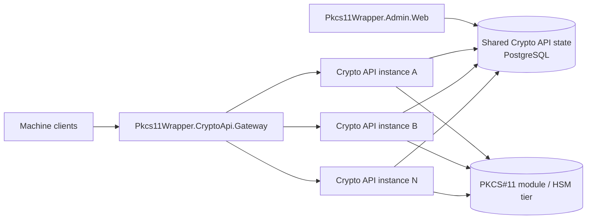

# Crypto API gateway ingress

`Pkcs11Wrapper.CryptoApi.Gateway` is the repository-owned ingress layer for the **one admin dashboard + many stateless Crypto API instances** topology.

It is intentionally a **thin YARP-based edge host**:

- front multiple `Pkcs11Wrapper.CryptoApi` instances behind one stable ingress endpoint
- keep the Crypto API instances stateless and replaceable
- remove unhealthy API instances from active load-balanced selection
- preserve the existing Crypto API surface instead of inventing a second customer contract
- leave room for future routing policy that can align with the HSM/backend dispatch groundwork added in issue #150

It is **not** meant to become a separate auth product.
Crypto API authentication, alias authorization, and PKCS#11 execution still happen in the upstream Crypto API hosts.

For the Crypto API host itself, see [docs/crypto-api-host.md](docs/crypto-api-host.md).
For the wider deployment topology, see [docs/crypto-api-deployment.md](docs/crypto-api-deployment.md).

## Current role in the topology



This first slice gives the repo a practical answer to fleet ingress:

- operators can point clients at **one gateway URL** instead of hand-wiring instance lists
- the gateway can spread traffic across healthy API instances
- the Crypto API host keeps owning authn/authz and HSM execution semantics
- the admin dashboard remains the single operator control plane

## What the gateway does today

The current host is intentionally small but useful:

- dedicated ASP.NET Core + YARP host at `src/Pkcs11Wrapper.CryptoApi.Gateway`
- repo-specific gateway options under `CryptoApiGateway`
- forwards the existing machine-facing Crypto API route space at the configured `ApiBasePath` (default `/api/v1`)
- configurable load-balancing policy (default `RoundRobin`)
- YARP active health checks against upstream Crypto API readiness endpoints
- gateway-local `/health/live` and `/health/ready` endpoints
- correlation-id preservation/generation via `X-Correlation-Id` by default
- practical request-body-size guard for ingress
- configurable upstream activity timeout
- gateway service document at `/` and `/gateway/runtime`

## Routing model

The gateway deliberately preserves the current Crypto API surface.

If the gateway is configured with:

```json
"CryptoApiGateway": {
  "ApiBasePath": "/api/v1"
}
```

then it forwards:

- `ANY /api/v1`
- `ANY /api/v1/{**catch-all}`

That means machine clients can keep using the same Crypto API endpoints through the gateway, for example:

- `GET /api/v1/runtime`
- `GET /api/v1/auth/self`
- `POST /api/v1/operations/authorize`
- `POST /api/v1/operations/sign`
- `POST /api/v1/operations/verify`
- `POST /api/v1/operations/random`

The gateway does **not** translate the public contract.
It only centralizes ingress and destination selection.

## Health-aware balancing model

The first slice uses **YARP active health checks** plus normal load balancing.

Current behavior:

- each configured destination points at one Crypto API instance
- the cluster health probe targets the destination's `/health/ready` endpoint by default
- after the configured number of consecutive probe failures, YARP removes that destination from healthy selection
- healthy destinations continue receiving traffic according to the configured load-balancing policy
- the gateway's own `/health/ready` endpoint independently probes the configured upstream destinations and returns `503` when it cannot confirm any healthy backend

This gives operators two practical signals:

- **client traffic steering:** handled by YARP destination health
- **gateway readiness for rollout/orchestration:** handled by the gateway readiness endpoint

## Configuration

Settings live under `CryptoApiGateway`.

```json
{
  "CryptoApiGateway": {
    "ServiceName": "Pkcs11Wrapper.CryptoApi.Gateway",
    "ClusterId": "crypto-api-fleet",
    "ApiBasePath": "/api/v1",
    "LoadBalancingPolicy": "RoundRobin",
    "CorrelationIdHeaderName": "X-Correlation-Id",
    "MaxRequestBodySizeBytes": 1048576,
    "HttpClient": {
      "ActivityTimeoutSeconds": 30,
      "DangerousAcceptAnyServerCertificate": false
    },
    "HealthChecks": {
      "Active": {
        "Enabled": true,
        "IntervalSeconds": 5,
        "TimeoutSeconds": 2,
        "ConsecutiveFailuresThreshold": 2,
        "Path": "/health/ready"
      }
    },
    "Destinations": [
      {
        "Name": "crypto-api-a",
        "Address": "http://crypto-api-a.internal:8080/",
        "Health": "http://crypto-api-a.internal:8080/"
      },
      {
        "Name": "crypto-api-b",
        "Address": "http://crypto-api-b.internal:8080/",
        "Health": "http://crypto-api-b.internal:8080/"
      }
    ]
  }
}
```

Notes:

- `ApiBasePath` should normally match the upstream Crypto API hosts' public base path.
- `LoadBalancingPolicy` accepts YARP policies such as `RoundRobin`, `LeastRequests`, `Random`, or `PowerOfTwoChoices`.
- `CorrelationIdHeaderName` defaults to `X-Correlation-Id`; the gateway preserves an incoming value or creates one when missing.
- `MaxRequestBodySizeBytes` is a practical ingress guard, not a full API-product policy engine.
- `HttpClient:ActivityTimeoutSeconds` caps how long the gateway allows a proxied request to stay active upstream.
- `Destinations[*].Health` is optional; if omitted, the gateway uses the same base address for health probes and traffic.

## Local run example

```bash
cd src/Pkcs11Wrapper.CryptoApi.Gateway
export ASPNETCORE_URLS=http://127.0.0.1:8090
export CryptoApiGateway__ApiBasePath=/api/v1
export CryptoApiGateway__Destinations__0__Name=crypto-api-a
export CryptoApiGateway__Destinations__0__Address=http://127.0.0.1:8081/
export CryptoApiGateway__Destinations__0__Health=http://127.0.0.1:8081/
export CryptoApiGateway__Destinations__1__Name=crypto-api-b
export CryptoApiGateway__Destinations__1__Address=http://127.0.0.1:8082/
export CryptoApiGateway__Destinations__1__Health=http://127.0.0.1:8082/
dotnet run
```

Useful endpoints:

- `/`
- `/gateway/runtime`
- `/health/live`
- `/health/ready`
- `/api/v1/...` forwarded to healthy upstream Crypto API instances

## Deployment guidance

A practical production-oriented split is:

- one `Pkcs11Wrapper.Admin.Web`
- one `Pkcs11Wrapper.CryptoApi.Gateway`
- many `Pkcs11Wrapper.CryptoApi` instances behind the gateway
- one shared PostgreSQL database for Crypto API control-plane data

The gateway should sit at the fleet edge where you want:

- one DNS name / ingress entry point for API clients
- health-aware instance selection
- request body guards and timeout policy
- response/request correlation IDs for tracing

The gateway should **not** own:

- API key issuance or key lifecycle
- alias/policy control-plane state
- PKCS#11 execution semantics
- tenant/global product policy beyond lightweight ingress concerns

## Relationship to issue #150 HSM routing/dispatch groundwork

Issue #150 introduced explicit multi-backend routing and failover inside the Crypto API hosts.
That work operates at the **PKCS#11 backend / alias dispatch layer**.

This gateway issue adds a separate layer at the **HTTP fleet ingress layer**.

That separation is deliberate:

- the gateway decides **which Crypto API instance** gets the request
- the selected Crypto API instance still decides **which PKCS#11 backend/route candidate** executes the operation

This keeps room for future integration without over-coupling the first slice.
Examples of follow-up work that can build on both layers later:

- route-group-aware gateway clusters or shard hints
- per-route-group ingress policy once the control plane exposes it cleanly
- richer edge telemetry tied to alias/route-group execution outcomes

## Validation covered in this slice

The repository test lane for the gateway currently covers:

- service document / topology reporting
- load balancing across healthy backends
- active-health removal of unhealthy destinations
- correlation-id generation and preservation
- request-body-size rejection before proxying

That makes the gateway behavior testable without requiring a full HSM-backed lab for every ingress regression.
